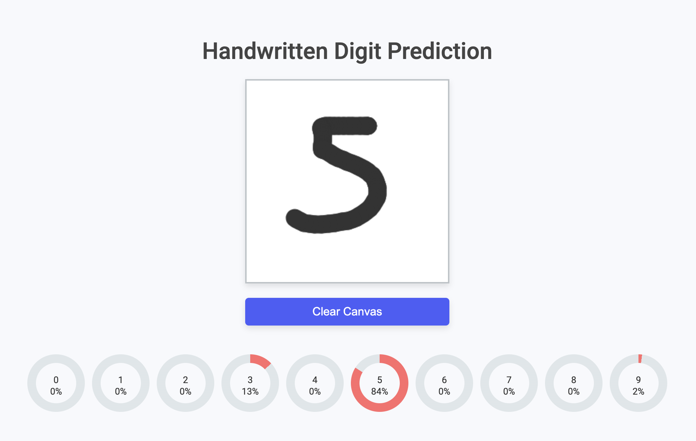

# Handwritten Digit Prediction

This project demonstrates a simple web-based application for predicting handwritten digits using a pre-trained MNIST model converted from PyTorch to ONNX. Users can draw digits on a canvas, and the model will predict the digit in real-time, displaying the probabilities for each digit (0-9).

## Features

- Draw digits on a canvas
- Real-time digit prediction
- Clear canvas functionality
- Radial progress bars to visualize prediction probabilities

## Demo

[Try out the Handwritten Digit Prediction here!](https://sujen07.github.io/mnist-prediction/src/)

## Project Structure

The project is structured as follows:

- `index.html`: The main HTML file that sets up the layout of the page.
- `style.css`: The CSS file for styling the page.
- `app.js`: The JavaScript file that contains the logic for handling the canvas drawing and model prediction.
- `model.onnx`: The ONNX model file converted from a PyTorch MNIST model.

## Sample




## How to Run

1. Clone the repository:
    ```sh
    git clone https://github.com/yourusername/handwritten-digit-prediction.git
    ```
2. Navigate to the project directory:
    ```sh
    cd handwritten-digit-prediction
    ```
3. Ensure you have a web server running. If you have Python installed, you can use the following command:
    ```sh
    python -m http.server
    ```
4. Open your browser and go to:
    ```
    http://localhost:8000
    ```

5. Draw a digit on the canvas and see the prediction results in real-time.

## Acknowledgements

- The MNIST model was trained using PyTorch and converted to ONNX.
- ONNX Runtime is used for running the model in the browser.
- The project uses HTML5 Canvas for drawing digits and JavaScript for handling the user interactions and predictions.
